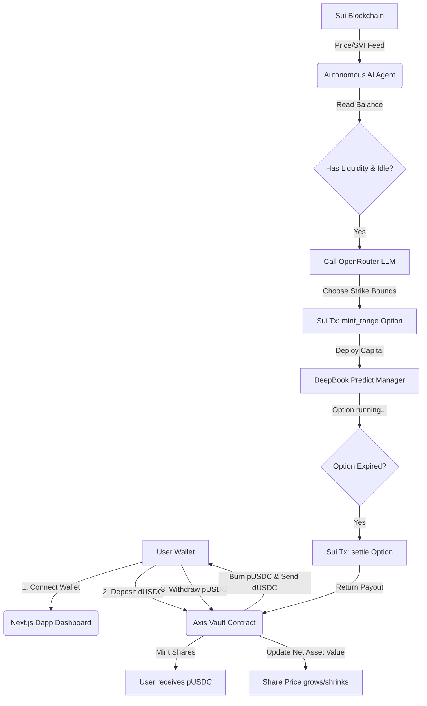
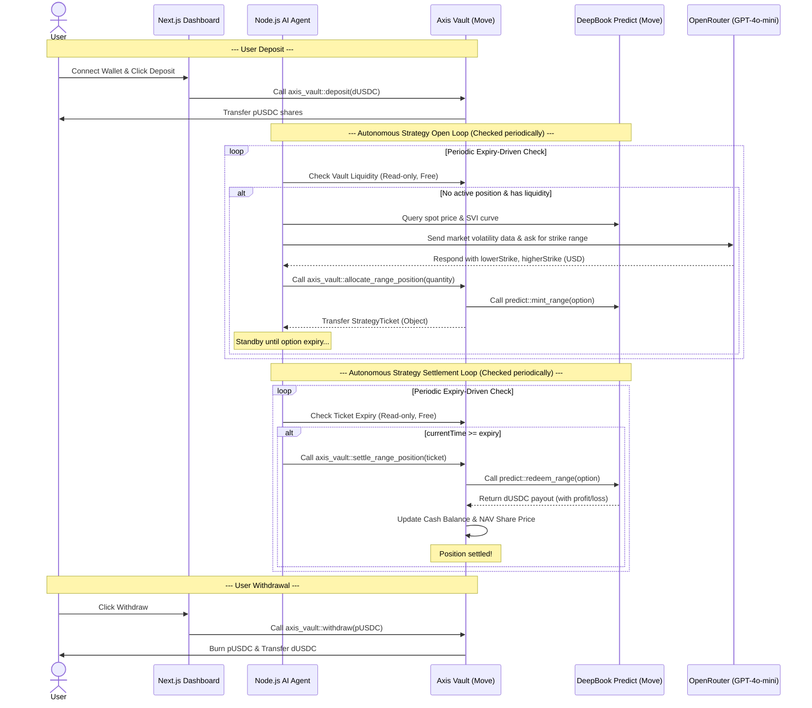

# 🌌 Axis Predict: Autonomous DeFAI Option Vault on Sui


[](https://opensource.org/licenses/MIT)
[](https://sui.io/)
[](https://move-book.com/)
[](https://www.typescriptlang.org/)

Axis Predict is a decentralized, autonomous Delta-Neutral yield vault built on **Sui Testnet** that utilizes **DeepBook Predict** (a volatility-priced prediction/option market protocol) and an **AI Trading Agent** to capture yield from volatility.

---

## 🗺️ System Overview

The system consists of three main components:
1. **Move Smart Contracts (`sc/`)**: An on-chain shared vault (`AxisVault`) that pools user assets (`dUSDC`), issues liquidity share tokens (`pUSDC`), and grants authorization to an AI Agent to deploy range option strategies.
2. **Backend Agent Service (`apps/backend/`)**: An Express server and background scheduler that autonomously checks vault balances, analyzes spot volatility, consults an LLM (via OpenRouter) to determine optimal strike bounds, and executes range options on-chain.
3. **Frontend Dashboard (`apps/frontend/`)**: A Next.js Web App featuring a high-fidelity dashboard for wallet connection, deposits, withdrawals, live SVI/oracle range visualizations, and real-time AI reasoning stream.

---

## 🔄 User Flow Diagram

The following diagram illustrates how users, the AI agent, the vault contract, and the DeepBook Predict protocol interact:



---

## ⏱️ Sequence Diagram

Below is the step-by-step transaction flow, showing the user lifecycle alongside the agent's autonomous cycle:



---

## 📂 Project Structure

This monorepo is managed using `pnpm` workspaces:

```bash
sui-defai-project/
├── apps/
│   ├── backend/           # Express server & Autonomous Agent scheduler
│   └── frontend/          # Next.js web application (Dashboard UI)
├── sc/
│   └── defai_agent/       # Move Smart Contracts (Axis Vault & pUSDC Token)
├── docs/                  # Project specifications and guides
├── package.json           # Monorepo workspaces definition
├── pnpm-workspace.yaml    # pnpm workspace configuration
└── pnpm-lock.yaml         # Monorepo lockfile
```

---

## ⚙️ Prerequisites & Installation

### Prerequisites
* **Node.js** (v18.x or newer, v22 recommended)
* **pnpm** (v11.x or newer)
* **Sui CLI** (For compiled Move contracts and gas keys management)

### Installation
Clone the repository and install all workspace dependencies from the root directory:

```bash
pnpm install
```

---

## 🚀 Running the Project

### 1. Smart Contracts
Compile and publish the Move smart contracts to Sui Testnet:
```bash
cd sc/defai_agent
# Compile Move modules
sui move build
# Publish package
sui client publish --gas-budget 200000000
```

### 2. Backend Agent
1. Setup your `.env` file inside `apps/backend/` using the `.env.example` template.
2. Build and start the Express server and autonomous scheduler:
```bash
pnpm --filter backend build
pnpm --filter backend dev
```

### 3. Frontend Web App
1. Setup your `.env` file inside `apps/frontend/` using the `.env.example` template.
2. Build and start the Next.js dev server:
```bash
pnpm --filter frontend dev
```
Open [http://localhost:3000](http://localhost:3000) to view the dashboard.

---

## 🔗 On-Chain Addresses (Sui Testnet)

* **Package ID (Program ID)**: `0x648d599af57d2f19dd42ffbd2a9a9baf72ab590db9aac0af09a00c1a7236baf9`
* **AxisVault (Shared Object)**: `0x4a6aaa5b41421f6368745bfa4f8019b157673b9d0c83c530d36177b7266852da`
* **Agent Strategy Capability (`StrategyCap`)**: `0xa0c596dc19015d7f2e28c883109a92bb992bf8ea8565558f186bdb4811c351d8`
* **DeepBook Predict Manager**: `0x26c750b04958aa180459715624c50683923e1e7aee26e579b2c3aeded6843d18`

---

## 📄 License
This project is licensed under the ISC License. See `LICENSE` for details.
