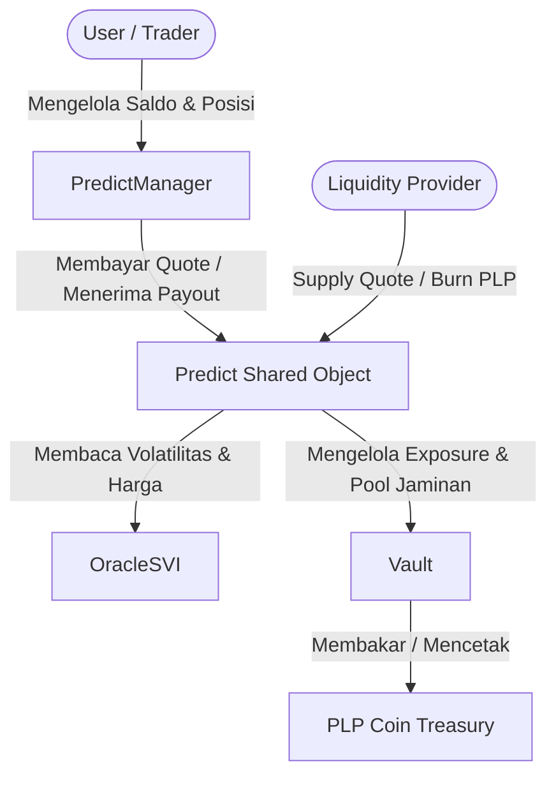

# 📖 DeepBook Predict: Architecture & Design Overview

DeepBook Predict adalah protokol pasar prediksi (*prediction market*) dan derivatif berbasis waktu kedaluwarsa (*expiry-based*) yang dikembangkan sebagai bagian dari ekosistem DeepBook V3 di jaringan Sui. 

Dokumen ini menyediakan panduan tingkat tinggi mengenai arsitektur, objek-objek utama, serta penyelesaian masalah (*problem statement*) yang ditangani oleh DeepBook Predict.

---

## 🎯 Problem Statement (Masalah yang Diselesaikan)

DeepBook Predict dirancang untuk mengatasi beberapa hambatan utama yang dihadapi pasar prediksi tradisional dan DeFi saat ini:

### 1. Masalah "Cold Start" Likuiditas
Pasar prediksi tradisional sering kali gagal berkembang karena kesulitan menarik penyedia likuiditas (*Market Makers*) sejak awal peluncuran. DeepBook Predict mengatasi hal ini dengan menyertakan **Internal Market Maker** terintegrasi, yang memastikan setiap pasar baru langsung memiliki kuotasi harga (*quotes*) siap pakai sejak menit pertama tanpa memerlukan negosiasi *liquidity provider* secara manual.

### 2. Efisiensi Modal yang Rendah
Sebagian besar pasar prediksi hanya mendukung taruhan biner (*Yes/No*). DeepBook Predict memperkenalkan konsep **Vertical Ranges** (taruhan pada rentang harga tertentu) dan integrasi leverage, memungkinkan pengguna untuk mengeksekusi strategi lindung nilai (*hedging*) atau spekulasi yang jauh lebih efisien secara kapital.

### 3. Komposabilitas DeFi yang Terfragmentasi
Predict dirancang bukan sebagai aplikasi terisolasi, melainkan sebagai **financial primitive** yang modular. Kontrak ini terintegrasi secara native dengan modul Spot dan Margin dari DeepBook V3, memungkinkan pengembang untuk membuat produk terstruktur (*structured products*), opsi (*options*), dan instrumen leverage lainnya yang semuanya menggunakan satu *liquidity pool* bersama.

### 4. Pricing Tingkat Institusional
Bekerja sama dengan penyedia data terkemuka seperti **Block Scholes**, DeepBook Predict membawa metrik volatilitas opsi institusional (seperti model volatilitas *Stochastic Volatility Inspired* atau **SVI**) secara on-chain untuk menentukan harga opsi biner secara adil dan transparan.

---

## 🏛️ Arsitektur Objek Utama On-Chain

Sistem utama DeepBook Predict dikelola oleh 5 objek on-chain utama:

### 1. `Predict` (Shared Object Utama)
Objek tingkat atas protokol yang menyimpan konfigurasi harga, spread, daftar koin jaminan yang diperbolehkan (*allowlist*), konfigurasi risiko total, pembatas penarikan (*withdrawal limiter*), serta kapabilitas pencetakan token LP (`PLP`).
*   **Peran**: Diposkan ke setiap transaksi perdagangan dan likuiditas untuk memvalidasi parameter pasar.

### 2. `PredictManager` (Shared Object Akun Pengguna)
Objek representasi akun perdagangan terdesentralisasi milik setiap pengguna. Objek ini membungkus `BalanceManager` milik DeepBook V3.
*   **Penyimpanan Posisi**: Berbeda dengan ERC1155 atau NFT standar, posisi biner dan posisi rentang (*range positions*) **tidak disimpan sebagai objek terpisah**, melainkan berupa angka kuantitas (*quantities*) yang dicatat dalam tabel internal di dalam `PredictManager` masing-masing pengguna.
*   **Efisiensi**: Memungkinkan perdagangan massal (*bulk trading*) dan settlement dengan biaya gas yang sangat efisien karena tidak ada siklus penciptaan/penghancuran objek baru.

### 3. `OracleSVI` (State Volatilitas Pasar)
Objek yang mewakili status pasar untuk satu aset dasar (*underlying asset*) dan satu tanggal kedaluwarsa (*expiry*). Objek ini menyimpan:
*   Harga spot & harga forward saat ini.
*   Parameter SVI (*Stochastic Volatility Inspired*) untuk kurva volatilitas implisit.
*   Timestamps pembaruan data.
*   Status siklus hidup (*lifecycle*) oracle.

### 4. `Vault` (State State Mesin Likuiditas)
Pengelola kas jaminan yang bertindak sebagai lawan (*counterparty*) untuk setiap posisi yang dibuka oleh trader. Vault menyimpan:
*   Saldo koin jaminan (*quote assets*) fisik.
*   Matriks risiko per-strike untuk memantau liabilitas *mark-to-market*.
*   Maksimum batas pembayaran yang harus ditutup (*maximum payout*).

### 5. `PLP` (Predict Liquidity Provider Coin)
Token saham likuiditas yang dicetak ketika LP memasukkan aset jaminan ke dalam Vault, dan dibakar ketika LP melakukan penarikan dana. Mewakili klaim proporsional atas nilai total aset di dalam Vault.

---

## 📡 Referensi Deployment & Target Integrasi (Sui Testnet)

Detail alamat kontrak DeepBook Predict pada jaringan **Sui Testnet** (berdasarkan branch `predict-testnet-4-16`):

| Parameter | Alamat / Nilai | Deskripsi |
| :--- | :--- | :--- |
| **Package ID** | `0xf5ea2b3749c65d6e56507cc35388719aadb28f9cab873696a2f8687f5c785138` | Alamat paket smart contract |
| **Registry ID** | `0x43af14fed5480c20ff77e2263d5f794c35b9fab7e2212903127062f4fe2a6e64` | Registri konfigurasi oracles & aset |
| **Predict Object ID** | `0xc8736204d12f0a7277c86388a68bf8a194b0a14c5538ad13f22cbd8e2a38028a` | Objek bersama untuk interaksi trading |
| **Quote Asset Coin Type** | `0xe95040085976bfd54a1a07225cd46c8a2b4e8e2b6732f140a0fc49850ba73e1a::dusdc::DUSDC` | Aset jaminan resmi (DUSDC Testnet) |
| **PLP Share Coin Type** | `0xf5ea2b3749c65d6e56507cc35388719aadb28f9cab873696a2f8687f5c785138::plp::PLP` | Tipe koin untuk representasi saham LP |
| **Indexer Server URL** | `https://predict-server.testnet.mystenlabs.com` | Base URL untuk REST API data sekunder |
