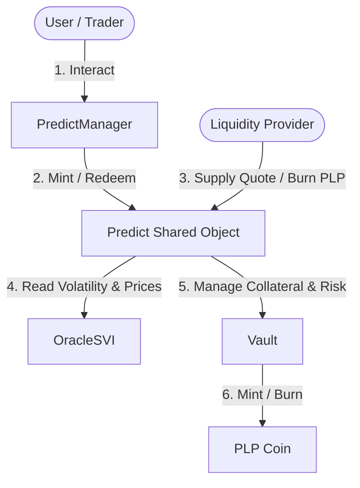
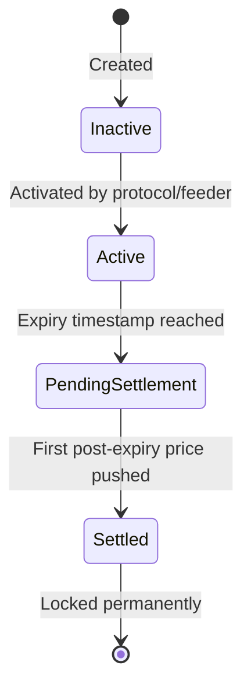
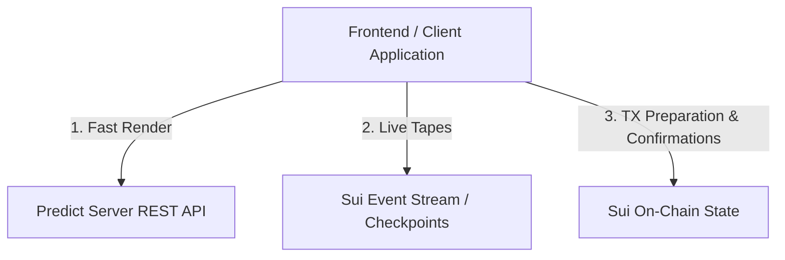

# 🏛️ DeepBook Predict: Design & Architecture

DeepBook Predict is designed as a modular financial primitive on Sui, enabling options and prediction markets natively on-chain. Below is a detailed breakdown of the protocol's architectural components, states, pricing mechanics, and data flows.

---

## 🗺️ High-Level Components

The protocol is built around four main shared objects:

### 1. `Predict` (Top-Level Shared Object)
This is the entry point for all trading and liquidity actions. It handles:
*   Protocol-wide configs (allowed quotes, spread, global risk parameters).
*   Oracle strike grids and withdrawal-limiter thresholds.
*   The `PLP` coin treasury capability.
*   Mint validation: Verifies signer rights, checks if the target oracle is active, evaluates spreads, updates vault liabilities, collects assets from the `PredictManager`, and registers the trade.
*   Redeem validation: Removes the liability, dispenses payouts from the Vault back to the user's `PredictManager`, and emits lifecycle events.

### 2. `PredictManager` (User Trading Account)
A shared account object that wraps a DeepBook `BalanceManager` and acts as the user's secure trading wallet.
*   **Modular Positioning**: All position assets (binary options or vertical range contracts) are **not minted as individual objects** (like NFTs or ERC-1155 tokens).
*   **Internal Position Tracking**: Positions are stored inside internal dynamic tables within the user's own `PredictManager`, keyed by `MarketKey` (for binary positions) or `RangeKey` (for vertical ranges).
*   **Benefits**: Extremely high gas efficiency during bulk trades and portfolio settlements.

### 3. `OracleSVI` (Market Volatility Feeder)
Maintains the implied volatility curve and spot/forward price inputs for a specific underlying asset and expiration date. It is updated periodically with Block Scholes calculations.

### 4. `Vault` (Shared Liquidity Pool & Risk Engine)
Acts as the central clearinghouse and counterparty to all traders.
*   Holds the quote asset tokens (e.g. `dUSDC`).
*   Computes real-time mark-to-market liabilities across all strikes.
*   Calculates maximum potential payouts to ensure the vault is never under-collateralized.

---

## 🔑 Positions and Keys

Instruments in DeepBook Predict are categorized into two types:

### 1. Binary Positions
Directional bets that pay out a fixed amount if the asset price settles above or below a strike.
*   **Key**: `MarketKey` composed of `(oracle_id, expiry, strike, is_up)`
*   `is_up = true`: Pays out $1.00 (denominated in quote) if `settlement_price > strike`.
*   `is_up = false` (Down position): Pays out if `settlement_price <= strike`.

### 2. Vertical Ranges
Bounded interval bets that pay out if the asset price settles within a range.
*   **Key**: `RangeKey` composed of `(oracle_id, expiry, lower_strike, higher_strike)`
*   Pays out if the settlement price falls within the interval `(lower_strike, higher_strike]`.

---

## 🔄 Oracle Lifecycle

An `OracleSVI` transitions through four distinct lifecycle states:

1.  **Inactive**: The oracle exists on-chain but is not open for trading.
2.  **Active**: Accepts live spot, forward, and SVI volatility parameter updates. Trading (minting/redeeming) is fully open.
3.  **Pending Settlement**: The expiration timestamp has passed, but the final settlement price has not yet been pushed. Trading is locked.
4.  **Settled**: The first price push after expiry freezes the settlement price. Further price or SVI updates are blocked. Traders can now redeem winning positions. The vault can compact strike matrices to free storage.

---

## 💰 Liquidity: Vault & PLP (Predict Liquidity Provider)

The Vault operates as a pool-to-peer liquidity provider.

### Supplying Liquidity
*   Users call `predict::supply` with accepted quote assets.
*   They receive `PLP` shares representing their stake in the vault.
*   The first supplier mints shares at a 1:1 ratio.
*   Subsequent suppliers receive shares proportional to their supplied value relative to the total value of the vault (including accrued trading profits).

### Withdrawing Liquidity
*   Users burn `PLP` shares to claim their portion of the quote assets.
*   **Limiter**: Withdrawals are blocked if the requested amount would reduce vault reserves below the level needed to cover active **max payout liabilities**.

---

## ⚙️ Pricing & Risk Management

### Pricing Formula
DeepBook Predict prices trades using the fair price computed from the SVI model + dynamic adjustments:
$$\text{Trade Price} = \text{Fair Price} \pm \text{Protocol Spread} \pm \text{Utilization Adjustment}$$
The protocol sets ask bounds per oracle to prevent transactions if spreads widen beyond acceptable limits.

### Risk Controls
After each mint transaction, the vault runs a validation check:
$$\text{Total Mark-to-Market Liability} \le \text{max\_total\_exposure\_pct} \times \text{Vault Balance}$$
If this check fails, the transaction reverts, protecting the vault from extreme volatility exposure.

---

## 📡 Recommended Data Flows for Client Applications

To maintain a fast, responsive UI while ensuring reliable blockchain transactions, applications should follow a hybrid data strategy:

1.  **Fast Renders (Indexer)**: Pull portfolios, market history, active oracle lists, and historical PnL from the public Predict Server (`https://predict-server.testnet.mystenlabs.com`).
2.  **Live Feeds (Sui Events)**: Subscribe to real-time events via Sui websocket/checkpoints to capture rapid price changes:
    *   `oracle::OraclePricesUpdated`
    *   `oracle::OracleSVIUpdated`
    *   `oracle::OracleSettled`
3.  **On-Chain Reads (Authoritative State)**: Query the absolute source of truth directly from Sui RPC for transaction building:
    *   Inspect `PredictManager` balance capabilities.
    *   Read current dynamic fields to confirm position sizes prior to calling Move entry points.
